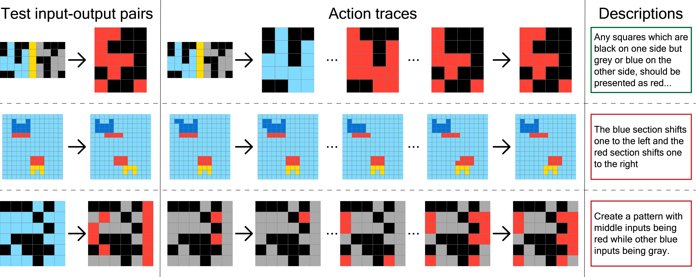

# Human Abstraction and Reasoning Corpus (H-ARC)

This repository contains scripts and additional information about H-ARC to accompany our paper (under review).

{style="background-color: white; padding: 10px;"}

The data can be downloaded from our [OSF repository](https://osf.io/bh8yq).

Participant responses, natural language descriptions, errors and state space graphs can all be explored visually on our [project webpage](https://arc-visualizations.github.io/index.html).

H-ARC consists of action by action traces of humans solving ARC tasks from the both the training and evaluation sets using an interface and setup similar to François Chollet's initial proposal. The original dataset can be found [here](https://github.com/fchollet/ARC-AGI).

## Citing our work

```
@article{legris2024harcrobustestimatehuman,
      title={H-ARC: A Robust Estimate of Human Performance on the Abstraction and Reasoning Corpus Benchmark},
      author={Solim LeGris and Wai Keen Vong and Brenden M. Lake and Todd M. Gureckis},
      year={2024},
      journal={arXiv preprint arxiv:2409.01374}
      url={https://arxiv.org/abs/2409.01374},
}
```

## Getting started

### Setting up the Python Environment

1. Ensure you have Python 3.10 or later installed on your system.

2. Clone this repository to your local machine:

   ```bash
   gh repo clone le-gris/h-arc
   cd h-arc
   ```

3. Create a virtual environment:

   ```bash
   python -m venv .venv
   ```

4. Activate the virtual environment:

   - On Windows:
     ```bash
     venv\Scripts\activate
     ```
   - On macOS and Linux:
     ```bash
     source .venv/bin/activate
     ```

5. Install the required packages using pip and the requirements.txt file:
   ```bash
   pip install -r requirements.txt
   ```

### Extracting the dataset

The H-ARC dataset can be downloaded as a zip archive from our OSF repository. To extract it:

1. Navigate to the project root directory if you're not already there and move the zip archive there. Make sure it is named `osfstorage-archive.zip`.

2. Use the following command to extract the dataset:
   - On Windows:
     ```bash
     tar -xf data/osfstorage-archive.zip
     ```
   - On macOS and Linux:
     ```bash
     unzip data/osfstorage-archive.zip
     ```

After extraction, you should see several CSV files in the `data` and `survey` folders.

## Dataset

The H-ARC dataset consists of several CSV files containing different aspects of human performance on ARC tasks.

All files are in CSV format. In the `data` folder, there are the following files:

- `data.csv`: All collected data from complete / incomplete participant data
- `incorrect_submissions.csv`: All unique errors on each task and their counts from complete/incomplete participant data
- `summary_data.csv`: Attempt by attempt summary data for complete/incomplete participant data
- [`readme.md`](data/readme.md): data directory description

In the `survey` folder, there are the following files:

- `feedback.csv`: Participant feedback
- `demographics.csv`: Demographic information
- `withdraw.csv`: Withdrawal information
- [`readme.md`](survey/readme.md): survey directory description

For more detailed information about the dataset, see each of the readme files.

### Running the Bayesian IRT Model

To analyze performance using a Bayesian Item Response Theory model:

1. Generate the model:

   ```bash
   python src/generate_IRT_model_results.py --n_samples 10000 --n_burn 2000 --seed 4 --impute
   ```

   Remove the `--impute` flag to exclude missing data from the analysis.

2. Generate plots and statistics:
   ```bash
   python src/IRT_model_plots_analysis.py --model_path models/bayes_IRT_model_burn2000_N10000_imputed_4.pkl --verbose
   ```

This will create trace plots, parameter visualizations, and detailed statistics in the `figures/` and `results/` directories.

## Analyses

We include in this repository the main Jupyter notebooks used to compute reported results from our paper.

### Notebooks

#### [0-arc-dataset.ipynb](analysis/0-arc-dataset.ipynb)

This notebook looks at some aspects of the ARC dataset structure.

#### [1-basic-results](analysis/1-basic-results.ipynb)

This notebook computes basic performance metrics on the H-ARC dataset, including overall solve rates, action counts, and time-related statistics for both training and evaluation tasks.

#### [2-demogrpahics](analysis/2-demographics.ipynb)

This notebook looks at some basic demographics data from our pool of participants.

#### [3-misc](analysis/3-misc.ipynb)

This notebook contains miscellaneous analyses, including participant counts for different experimental conditions and various data processing steps.

#### [4-errors](analysis/4-errors.ipynb)

This notebook analyzes error patterns in participant responses, including copy errors and other common mistake types across both training and evaluation tasks.

#### [5-learning](analysis/5-learning.ipynb)

This notebook examines learning effects across tasks using mixed-effects logistic regression models. It analyzes how task success rates change as participants progress through the experiment.

#### [6-incomplete-data-analysis](analysis/6-incomplete-data.ipynb)

This notebook focuses on analyzing incomplete task attempts, comparing performance metrics between participants who completed all tasks and those who didn't, and examining factors that might contribute to task incompletion.

#### [7-human-machine](analysis/7-human-machine.ipynb)

This notebook compares the performance of human participants with that of algorithmic solutions to evaluation set ARC tasks. It analyzes success rates, error patterns, and solution strategies between humans and AI systems.

#### [8-action-traces](analysis/8-action-traces.ipynb)

This notebook shows how to use the data to extract action traces for further analysis.

## Processing Kaggle Submission

Follow these steps to process a Kaggle submission file. This will faciliate downstream human-machine comparisons. Here we use the "Claude-3.5 (Baseline)" approach from the [ARC Prize leaderboard](https://arcprize.org/leaderboard) as an example.

1. Create the necessary directories:

   ```bash
   mkdir -p data/kaggle_solutions/claude3_5-langchain
   ```

2. Visit the following webpage:
   [Claude 3.5 Langchain ARC Submission](https://www.kaggle.com/code/gregkamradt/using-frontier-models-on-arc-agi-via-langchain/output)

3. Download the `submission.json` file from the webpage into the `data/kaggle_solutions/claude3_5-langchain` directory.

4. Run the `kaggle_submision_to_csv.py` script with the appropriate submission ID:
   ```bash
   python src/kaggle_submision_to_csv.py --submission_id claude3_5-langchain
   ```

This will process the JSON file and create a CSV file in the same directory with a similar format to our human data.

## License

This dataset is licensed under the [CC0 1.0 Universal](https://creativecommons.org/publicdomain/zero/1.0/) and can be used for any purposes.
